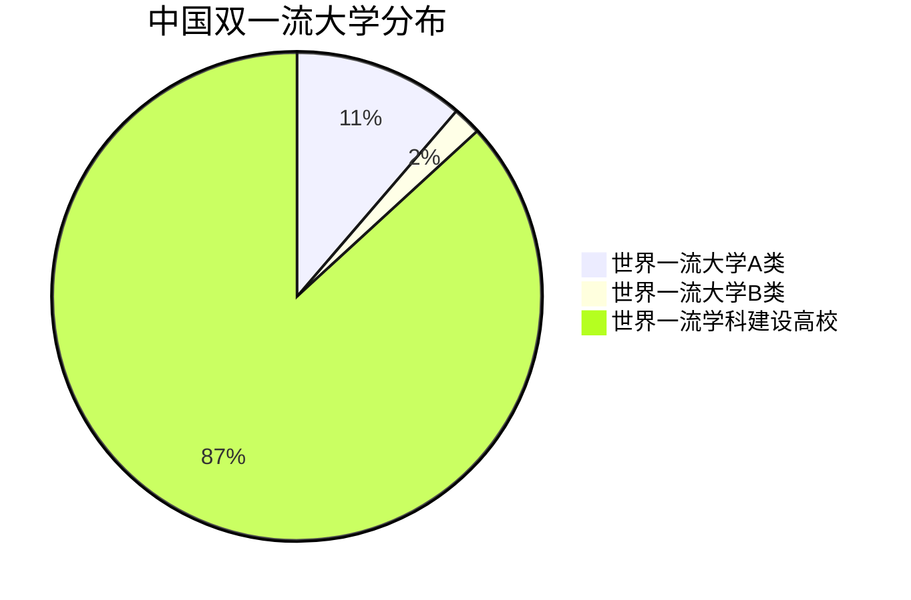
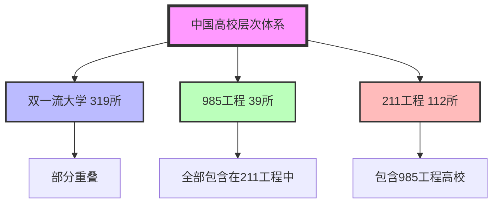
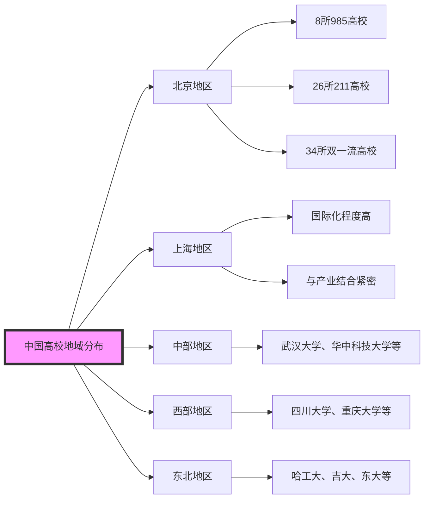
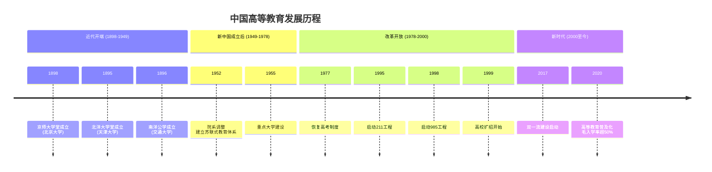
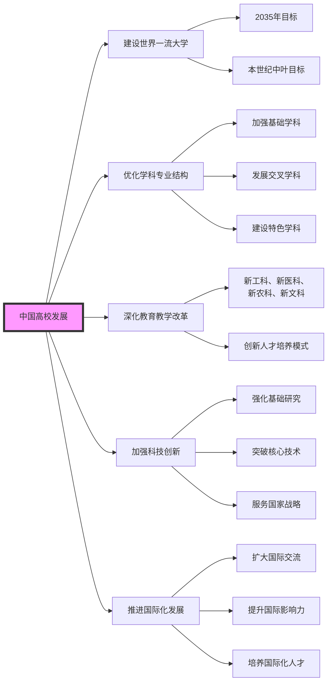

# 中国高等教育全景:从百年学府到世界一流大学

## 引言

中国高等教育体系庞大而复杂,拥有超过13,600所高等院校,涵盖综合性大学、理工类院校、师范类院校、医药类院校、艺术类院校等多种类型。从百年学府的深厚底蕴到新兴高校的蓬勃发展,中国高等教育正在经历着前所未有的变革与飞跃。本文将带您全面了解中国高校的整体格局、发展历程、特色优势以及未来趋势。

## 一、中国高校的层次体系

### 1.1 双一流大学

"双一流"是世界一流大学和一流学科建设的简称,是中国高等教育领域的重大国家战略。自2017年实施以来,全国共有319所高校入选"双一流"建设名单,其中42所高校进入世界一流大学建设行列(36所为A类,6所为B类),277所高校进入世界一流学科建设行列。

### 1.2 985工程高校

985工程是中华人民共和国政府为建设若干所世界一流大学和一批国际知名的高水平研究型大学而实施的教育计划。该工程于1998年5月4日启动,全国共有39所高校入选985工程,这些高校被誉为中国顶尖大学的代表。

### 1.3 211工程高校

211工程是中国政府面向21世纪,重点建设100所左右高等学校和重点学科领域的教育工程。全国共有112所高校入选211工程,其中包含了全部39所985高校。211高校基本覆盖了全国各省、自治区、直辖市。

## 二、中国高校的类型分布

中国高校按办学类型可分为以下几大类:

### 2.1 综合类大学

综合类大学学科门类齐全,涵盖文、理、工、医、法、经济、管理等多个学科领域。典型代表包括:
- **北京大学**: 创建于1898年,初名京师大学堂,是中国近代第一所国立综合性大学
- **清华大学**: 诞生于1911年,是中国乃至亚洲最著名的高等学府之一
- **复旦大学**: 坐落于上海,是一所世界知名、国内顶尖的综合性研究型大学
- **南京大学**: 历史悠久,学科实力雄厚,是国家重点建设的综合性大学

### 2.2 理工类大学

理工类大学以理工科为主,强调工程技术应用和科学研究。代表院校有:
- **天津大学**: 中国第一所现代大学,开创了中国近代高等教育之先河
- **大连理工大学**: 中国共产党为迎接新中国建设而创建的第一所正规大学
- **华中科技大学**: 工科实力突出,在医学领域也有重要影响
- **西安交通大学**: 具有百年历史的著名工科大学

### 2.3 师范类大学

师范类大学以培养教师和教育工作者为主要任务,同时也发展了较强的综合学科实力。代表院校包括:
- **北京师范大学**: 中国师范教育的最高学府,世界一流大学建设A类高校
- **华东师范大学**: 教育部与上海市共建的综合性研究型大学
- **东北师范大学**: 国家首批"211工程"重点建设大学
- **华中师范大学**: 师范教育特色鲜明,学科门类齐全

### 2.4 医药类大学

医药类大学专注于医学教育和医学研究,培养医疗卫生人才。著名院校有:
- **北京协和医学院**: 中国国家级医学科学学术中心和综合性科学研究机构
- **北京中医药大学**: 以中医药学为主干学科的全国重点大学
- **上海交通大学医学院**: 国内顶尖的医学院校
- **复旦大学上海医学院**: 医学教育和研究实力雄厚

### 2.5 财经类大学

财经类大学以经济学、管理学学科为主,培养经济管理人才。代表院校包括:
- **中央财经大学**: 被誉为"中国财经管理专家的摇篮"
- **上海财经大学**: 以经济管理学科为主,多学科协调发展的研究型大学
- **对外经济贸易大学**: 国际经济与贸易、金融学专业特色鲜明
- **西南财经大学**: 中国西部地区财经类高校的代表

### 2.6 语言类大学

语言类大学以外语教育和研究为主,培养国际化人才。代表院校有:
- **北京外国语大学**: 中国外语教育的重要基地
- **上海外国语大学**: 多语种、多学科协调发展
- **广东外语外贸大学**: 外语与经贸相结合的特色大学

### 2.7 艺术类大学

艺术类大学专门培养艺术人才,涵盖音乐、美术、戏剧、电影等多个领域。代表院校包括:
- **中央美术学院**: 中国美术教育最高学府
- **中央音乐学院**: 全国音乐教育的中心
- **中央戏剧学院**: 中国戏剧影视艺术教育的最高学府
- **中国美术学院**: 中国最早的国立高等艺术学府

### 2.8 民族类大学

民族类大学以服务少数民族地区教育为使命,培养少数民族人才。代表院校有:
- **中央民族大学**: 国家民族事务委员会直属重点大学
- **西南民族大学**: 西南地区民族高等教育的重要基地
- **中南民族大学**: 服务中南地区少数民族教育
- **广西民族大学**: 服务东盟和北部湾经济区建设

## 三、中国高校的地域分布

中国高校分布呈现出明显的地域特征:

### 3.1 北京地区

北京作为首都,汇聚了全国最多的高等教育资源,拥有:
- 8所985高校(全国共39所)
- 26所211高校(全国共112所)
- 34所双一流高校(全国共319所)

北京高校具有以下特点:
- **学科齐全**: 覆盖所有学科门类
- **师资雄厚**: 汇聚了全国最优秀的师资力量
- **科研实力强**: 国家级重点实验室、重点学科数量全国领先
- **国际影响力大**: 多所大学在国际排名中名列前茅

### 3.2 上海地区

上海作为中国最大的经济中心城市,高校资源丰富,具有以下特点:
- 国际化程度高
- 与产业结合紧密
- 创新创业氛围浓厚
代表院校包括复旦大学、上海交通大学、同济大学等。

### 3.3 中部地区

中部地区高校以武汉大学、华中科技大学、湖南大学、中南大学等为代表,形成了较强的高校集群。这些高校:
- 学科实力雄厚
- 服务地方经济社会发展能力强
- 在一些优势学科领域具有全国影响力

### 3.4 西部地区

西部地区高校以四川大学、重庆大学、西安交通大学、兰州大学等为代表,特点如下:
- 具有地域特色
- 服务西部大开发战略
- 在一些特色学科领域优势明显

### 3.5 东北地区

东北地区高校以哈尔滨工业大学、吉林大学、东北大学、大连理工大学等为代表,具有以下特点:
- 工科实力雄厚
- 历史底蕴深厚
- 服务东北老工业基地振兴

## 四、中国高校的发展历程

### 4.1 近代高等教育的开端(1898-1949年)

中国现代高等教育的开端可以追溯到19世纪末。1898年,京师大学堂(北京大学前身)成立,标志着中国近代高等教育的诞生。这一时期成立的重要高校还有:
- **天津大学**(1895年): 中国第一所现代大学
- **交通大学**(1896年): 早期工程教育的代表
- **浙江大学**(1897年): 早期综合性大学的代表

### 4.2 新中国成立后的发展(1949-1978年)

新中国成立后,高等教育体系进行了大规模调整:
- 1952年院系调整: 建立了苏联式的高等教育体系
- 新建了一批专门性院校
- 形成了中央和地方两级管理体制

### 4.3 改革开放时期(1978-2000年)

改革开放以来,中国高等教育快速发展:
- 恢复高考制度(1977年)
- 实施"211工程"(1995年)
- 实施"985工程"(1998年)
- 高校扩招(1999年起)

### 4.4 新时代的创新发展(2000年至今)

进入21世纪,中国高等教育进入创新发展阶段:
- 实施"双一流"建设(2017年)
- 推进高等教育内涵式发展
- 加强国际交流与合作
- 提升科技创新能力

## 五、中国高校的特色优势

### 5.1 学科优势

中国高校在多个学科领域具有世界领先优势:

**基础学科领域**
- 数学: 北京大学、复旦大学、山东大学
- 物理学: 中国科学技术大学、清华大学、南京大学
- 化学: 北京大学、南开大学、中国科学技术大学

**工程技术领域**
- 计算机科学: 清华大学、浙江大学、哈尔滨工业大学
- 材料科学: 北京科技大学、哈尔滨工业大学、西北工业大学
- 机械工程: 清华大学、华中科技大学、上海交通大学

**人文社科领域**
- 经济学: 北京大学、中国人民大学、厦门大学
- 法学: 中国人民大学、中国政法大学、武汉大学
- 文学: 北京大学、复旦大学、南京大学

**医学领域**
- 临床医学: 北京协和医学院、上海交通大学医学院、复旦大学上海医学院
- 中医学: 北京中医药大学、上海中医药大学、广州中医药大学

### 5.2 科研实力

中国高校科研实力不断增强:
- **科研经费**: 2024年,清华大学预算达385.69亿元,北京大学243.3亿元
- **科研平台**: 拥有大批国家级重点实验室、工程研究中心
- **科研成果**: 在Nature、Science等顶级期刊发表论文数量持续增长
- **技术创新**: 专利申请和授权数量位居世界前列

### 5.3 师资力量

中国高校汇聚了大批高水平师资:
- **两院院士**: 全国高校拥有中国科学院院士和中国工程院院士数百人
- **长江学者**: 教育部"长江学者奖励计划"特聘教授、讲座教授千余人
- **国家杰出青年基金获得者**: 数千人
- **海外高层次人才引进计划入选者**: 大批海外优秀学者回国任教

### 5.4 国际化水平

中国高校国际化程度不断提升:
- **国际合作**: 与世界一流大学建立了广泛的合作关系
- **留学生教育**: 来华留学生数量持续增长
- **国际排名**: 多所大学进入世界大学排名前列
- **国际认证**: 获得国际权威机构的认证

## 六、中国高校的挑战与展望

### 6.1 面临的挑战

尽管取得了巨大成就,中国高校仍面临一些挑战:
- **发展不平衡**: 东部地区高校实力明显强于中西部地区
- **学科结构有待优化**: 部分学科重复建设,特色不够鲜明
- **人才培养质量需要提升**: 创新人才培养体系有待完善
- **国际竞争力有待加强**: 在世界顶尖学科领域的影响力仍需提升

### 6.2 未来发展方向

面向未来,中国高校将朝着以下方向发展:

**建设世界一流大学**
- 到2035年,若干所大学进入世界一流大学前列
- 到本世纪中叶,建成一批世界顶尖大学

**优化学科专业结构**
- 加强基础学科建设
- 发展新兴交叉学科
- 建设特色优势学科

**深化教育教学改革**
- 推进"新工科、新医科、新农科、新文科"建设
- 创新人才培养模式
- 提升人才培养质量

**加强科技创新**
- 强化基础研究
- 突破关键核心技术
- 服务国家重大战略需求

**推进国际化发展**
- 扩大国际交流与合作
- 提升国际影响力
- 培养国际化人才

## 七、如何选择合适的大学

面对如此众多的高校,学生和家长在选择时需要考虑以下因素:

### 7.1 学术实力

- 学科排名和优势专业
- 师资力量
- 科研实力
- 学术声誉

### 7.2 地理位置

- 城市发展水平
- 就业机会
- 生活成本
- 气候环境

### 7.3 办学特色

- 学校类型(综合、理工、师范等)
- 培养模式
- 校园文化
- 国际化程度

### 7.4 就业前景

- 就业率
- 就业质量
- 薪资水平
- 发展空间

### 7.5 个人发展

- 兴趣爱好
- 职业规划
- 学习能力
- 家庭条件

## 八、结语

中国高等教育已经进入普及化阶段,正在从高等教育大国向高等教育强国迈进。拥有超过13,600所高等院校的中国,正在培养着数以千万计的优秀人才,为国家发展和社会进步提供了强有力的人才支撑和智力支持。

从百年学府的深厚底蕴到新兴高校的蓬勃发展,从985、211到"双一流"建设,中国高等教育正在经历着深刻的变革。面向未来,中国高校将继续坚持立德树人根本任务,深化教育教学改革,提升科技创新能力,为建设教育强国、科技强国、人才强国作出新的更大贡献。

无论是选择深造还是就业,了解中国高校的整体格局和特色优势,都将帮助您做出更明智的选择。让我们共同期待中国高等教育更加美好的明天!

---

*本文数据基于教育部2022年5月31日更新的全国高等学校名单整理,部分数据来源于各高校官网公开信息。*